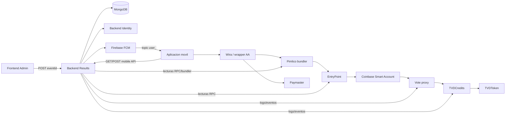
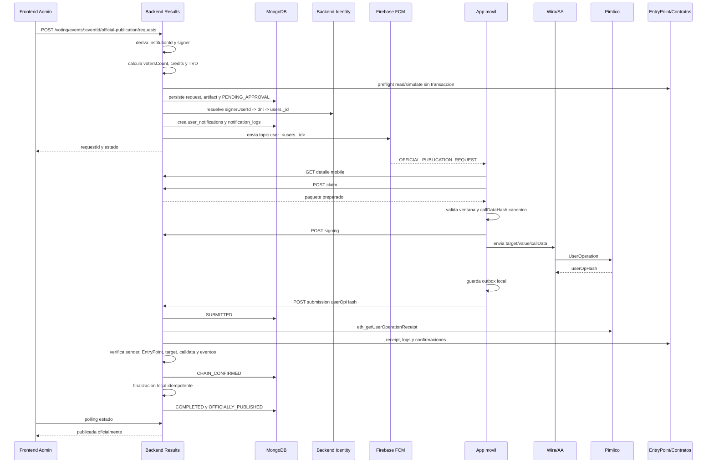

# Informe integral - publicacion oficial con firma movil

Estado documental: IMPLEMENTADO_PENDIENTE_EJECUCION_LOCAL  
Estado E2E real: E2E_REAL_BASE_SEPOLIA_PENDING  
Fecha de corte: 2026-07-23

## 1. Resumen ejecutivo

El flujo de publicacion oficial con firma movil separa la preparacion contractual en Backend Results, la aprobacion desde la aplicacion movil y la reconciliacion blockchain posterior. El frontend administrativo ya no firma ni ejecuta blockchain: crea o recupera una solicitud persistente, muestra estados y espera la confirmacion movil.

Sistemas cubiertos:

- Frontend administrativo: crea solicitudes, muestra estados, polling, cancelacion y errores funcionales.
- Backend Results: deriva institucion, resuelve signer, calcula TVD, preflight, solicitud, notificacion, reconciliacion y finalizacion local.
- Aplicacion movil: recibe notificacion, abre detalle, reclama, firma con smart account, guarda outbox y registra `userOpHash`.
- Backend Identity: fuente de identidad/carnet y relacion usuario-cuenta, sin endpoints nuevos.
- Firebase/FCM: entrega al topico personal `user_<users._id>`.
- Wira SDK / wrapper AA: Coinbase Smart Account, Pimlico, paymaster y envio AA.
- Contratos Base Sepolia: Vote proxy, TVDCredits, TVDToken y EntryPoint.

Conclusion tecnica: el paquete queda documentado y con cobertura automatizable preparada para ejecucion local. No se ejecutaron tests, build, lint, typecheck, FCM real ni transacciones reales durante este cierre.

## 2. Arquitectura



## 3. Secuencia completa



## 4. Estados y transiciones

| Estado | Tipo | Actor que entra | Condicion | Recuperacion |
| --- | --- | --- | --- | --- |
| PREPARING | Activo | Backend Results | Creacion inicial y snapshot en curso | Error gestionado a FAILED_RETRYABLE o FAILED_FINAL |
| PENDING_APPROVAL | Activo | Backend Results | Preflight exitoso, request notificable | Puede expirar, rechazarse, cancelarse o reclamarse |
| CLAIMED | Activo | App movil | Signer reclama desde un dispositivo | Claim idempotente del mismo dispositivo; conflicto para otro |
| SIGNING | Activo | App movil | Signer inicia firma | Puede registrar submission o rechazar antes de hash |
| SUBMITTED | Activo post-submit | App movil | `userOpHash` unico registrado | Worker reconcilia; no se puede liberar como pre-submit |
| CHAIN_PENDING | Activo post-submit | Worker | Receipt ausente o confirmaciones insuficientes | Reintento con backoff |
| CHAIN_CONFIRMED | Activo post-chain | Worker | Receipt, sender, EntryPoint, calldata y eventos validos | Finalizacion local |
| FINALIZING | Activo post-chain | Backend Results | Efectos locales en curso | Reanuda por marcadores de progreso |
| COMPLETED | Terminal | Backend Results | Evento publicado y solicitud cerrada | Idempotente |
| REJECTED | Terminal pre-submit | App movil | Usuario rechaza antes de envio | Idempotente |
| EXPIRED | Terminal pre-submit | Backend Results | Ventana o request vencida sin hash | No firma |
| CANCELLED | Terminal pre-submit | Admin | Cancelacion segura antes de submission | Idempotente |
| FAILED_RETRYABLE | Recuperable | Backend/Worker | Error temporal | Conserva activeKey si post-submit |
| FAILED_FINAL | Terminal | Backend/Worker | Revert definitivo o error funcional irreversible | No reenvia |
| NEEDS_REVIEW | Recuperable bloqueante | Backend/Worker | Evidencia incompatible | Conserva activeKey y evita otra solicitud |

Ruta feliz:

`PREPARING -> PENDING_APPROVAL -> CLAIMED -> SIGNING -> SUBMITTED -> CHAIN_PENDING -> CHAIN_CONFIRMED -> FINALIZING -> COMPLETED`.

## 5. Endpoints

### Administrativos

| Metodo | Ruta | Actor | Datos permitidos | Datos prohibidos |
| --- | --- | --- | --- | --- |
| POST | `/api/v1/voting/events/:eventId/official-publication/requests` | Admin institucional | `eventId` path | institutionId, signer, callData, roots, costos, status |
| GET | `/api/v1/voting/events/:eventId/official-publication/requests/active` | Admin institucional | `eventId` path | filtros de institucion desde cliente |
| GET | `/api/v1/voting/official-publication/requests/:requestId` | Admin autorizado | `requestId` path | artefactos cifrados, nullifiers, DNI |
| POST | `/api/v1/voting/official-publication/requests/:requestId/cancel` | Admin autorizado | reasonCode seguro si existe | cancelar post-submit |

### Moviles

| Metodo | Ruta | Actor | Datos permitidos | Datos prohibidos |
| --- | --- | --- | --- | --- |
| GET | `/api/v1/mobile/official-publication/requests/:requestId` | Signer | `requestId` path | callData antes del claim |
| POST | `/api/v1/mobile/official-publication/requests/:requestId/claim` | Signer | `deviceId` | userId, wallet, institutionId |
| POST | `/api/v1/mobile/official-publication/requests/:requestId/signing` | Signer | `deviceId` | firma, PIN, biometria |
| POST | `/api/v1/mobile/official-publication/requests/:requestId/reject` | Signer | `deviceId`, reasonCode enum | texto libre largo, status |
| POST | `/api/v1/mobile/official-publication/requests/:requestId/submission` | Signer | `deviceId`, `userOpHash`, `txHash?` | target, value, callData, CHAIN_CONFIRMED |

No existe endpoint cliente para `CHAIN_CONFIRMED`, `FINALIZING` ni `COMPLETED`.

## 6. Preflight y TVD

Reglas documentadas:

- `institutionId` contractual se deriva en Backend Results: `event.tenantId -> tenant_admin_assignments.applicationId -> institutional_admin_applications._id`.
- `convotatedUsers` viene de `padronUsersService.getPadronUsersFromEvent(event, { includeDisabled: false })`.
- `requiredCredits = BigInt(convotatedUsers.length)`.
- `requiredTvd = requiredCredits * tvdPerCredit`.
- `tvdPerCredit = 1000000000000000000`.
- Spender de allowance: TVDCredits `0xbb4ea03105e2d883ab234d95f10dc7cc5000bb40`.
- TVDToken: `0x0156D96BAbC74139a5cdb2cf2C90FDA1F6B53562`.
- Vote proxy: `0x7B57eE9103fc46eD6794329C36D2919293F0Fabb`.
- Implementacion reportada: `0xb9EBfAcA95Ca68F774084DDE30c7E6Eb8e7eEea9`.
- `authorizedOperators(proxy) = true` debe validarse por lectura.
- El preflight no firma, no aprueba y no ejecuta `createVote`.
- Si preflight falla, no debe quedar solicitud notificable ni historial FCM accionable.

## 7. Firma movil y Account Abstraction

El flujo movil reutiliza la infraestructura existente: Coinbase Smart Account, Pimlico/bundler, paymaster y wrapper AA. El contrato del Paso 10A documenta EntryPoint v0.6:

- EntryPoint v0.6: `0x5FF137D4b0FDCD49DcA30c7CF57E578a026d2789`.

Hallazgo de auditoria local: el Wira SDK inspeccionado contiene referencias a `entryPoint07Address` y `version: '0.7'`. Antes del E2E real en Base Sepolia debe confirmarse que app, Wira, Backend Results y worker congelen la misma version. La matriz incluye casos de compatibilidad para esta discrepancia.

La app:

- no agrega PIN ni biometria especifica para este flujo;
- valida localmente `callDataHash` con ABI canonico;
- guarda `userOpHash` en outbox antes de submission;
- no reenvia UserOperation si ya obtuvo hash;
- no espera obligatoriamente receipt para registrar submission.

## 8. Notificaciones

Canal canonico aceptado:

`signerUserId -> roled_users.dni -> users._id -> topic FCM personal user_<users._id>`.

Backend Results garantiza:

- envio al canal personal del signer;
- no envio a todos los administradores;
- no envio a empadronados;
- no envio al requester cuando no es signer;
- historial persistente en `user_notifications`;
- log de envio en `notification_logs`;
- deduplicacion por `OFFICIAL_PUBLICATION_REQUEST:{requestId}:{signerUserId}`.

Limitaciones aceptadas:

- `READ_STATE_LOCAL_ONLY`: la vista/no vista continua con la convencion local de la app.
- `PERSONAL_TOPIC_NOT_SINGLE_TOKEN_GUARANTEE`: Backend Results no prueba un unico token FCM activo; formaliza un canal personal por usuario. El claim limita a un solo dispositivo ejecutor.

Payload FCM permitido:

```json
{
  "type": "OFFICIAL_PUBLICATION_REQUEST",
  "notificationId": "...",
  "requestId": "...",
  "route": "OfficialPublicationRequest"
}
```

## 9. Reconciliacion

El worker procesa `SUBMITTED`, `CHAIN_PENDING`, `CHAIN_CONFIRMED`, `FAILED_RETRYABLE` post-submit y `FINALIZING` recuperable. No procesa estados pre-submit ni terminales.

Validaciones:

- `userOperation.sender == request.smartAccountAddress`;
- EntryPoint igual al snapshot de la solicitud;
- `txHash` del bundler/receipt es autoritativo;
- target/value/inner calldata coinciden con solicitud;
- `callDataHash` canonico coincide;
- selector interno es `createVote`;
- `onChainElectionId`, `institutionId`, roots y votersCount coinciden;
- `VoteCreated` viene del Vote proxy correcto;
- eventos TVDCredits se validan si el ABI/logs entregan evidencia suficiente;
- confirmaciones configurables antes de `CHAIN_CONFIRMED`.

## 10. Finalizacion

La finalizacion local solo ocurre desde `CHAIN_CONFIRMED` y no ejecuta blockchain. Debe recuperar artefactos preparados, no consultar de nuevo el padron y no regenerar nullifiers, roots ni calldata.

Marcadores esperados:

- `treesPersistedAt`
- `credentialsIssuedAt`
- `sessionsCreatedAt`
- `eventPublishedAt`

Cada efecto local debe ser idempotente y reanudable. `COMPLETED` es idempotente.

## 11. Seguridad

Autoridades del flujo:

- `signerUserId`
- `smartAccountAddress`
- `requestId`
- `callDataHash`
- `userOpHash`
- receipt y eventos autoritativos

No son autoridad:

- `requestedByUserId` para acceso movil;
- carnet enviado por cliente;
- `institutionId` enviado por cliente;
- `callData` enviado por cliente;
- `txHash` movil;
- status enviado por cliente;
- token FCM enviado en la solicitud.

Datos prohibidos en respuestas/notificaciones/historial: claves, PIN, biometria, DNI/carnet completos, nullifiers, padron, `encryptedPayload`, `authTag`, tokens FCM, RPC URLs privadas y secretos Pimlico/paymaster.

## 12. Legacy

Permanecen temporalmente:

- `confirmOfficialPublication`
- `publishEvent`
- `executePreparedCreateVote`

El frontend administrativo nuevo debe utilizar los endpoints persistentes de solicitudes y no las rutas legacy. El retiro queda pendiente hasta el E2E real.

## 13. Limitaciones

- READ_STATE_LOCAL_ONLY
- PERSONAL_TOPIC_NOT_SINGLE_TOKEN_GUARANTEE
- ENTRYPOINT_VERSION_REQUIRES_FINAL_LOCAL_CONFIRMATION
- E2E_REAL_BASE_SEPOLIA_PENDING
- FULL_PIPELINE_EXECUTION_PENDING

